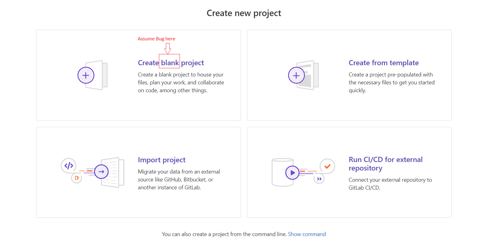

## Summary (Summarize the bug encountered concisely)

There is a typographical error in the title of the button that creates a new blank project on the Project page. The button currently displays "create black project" instead of the correct "create blank project."

## Steps to reproduce

In order to repoduce the bug, you need to navigate to the project page by clicking on a the plus on the left corner (https://gitlab.com/) and then click new project/deposit.Then you'll see the typographical error on the button on the first row in the left

## What is the current bug behavior?

The button title displays "create black project" instead of "creata blank project"

## What is the expected correct behavior?

The button title should be "create blank project"

## Relevant logs and/or screenshots

## Possible fixes

Go to the line where you assigned the title of the buttons and modify it

## Whom do you report/ Assign To/ Tags

/label ~bug ~typography
~cc @developer
/assihn @qa-tester

## Priority

According to the difficulty to solve the bug and the impact that has the bug on the program. I would say that it is a trivial bug
